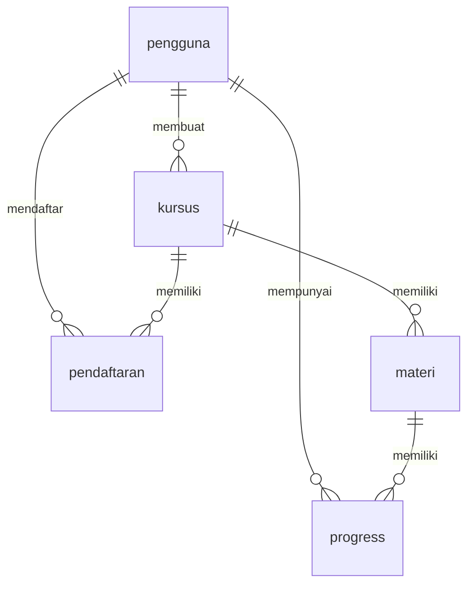

# 🎓 Learning Digital - Learning Management System (LMS)

Sistem Manajemen Pembelajaran Digital berbasis web yang dibangun dengan PHP dan MySQL untuk mengelola kursus online, mahasiswa, dan progres pembelajaran.

**🌐 Live URL**: https://www.belajardigital.andhikafajri.my.id/

## 📋 Daftar Isi
- [Fitur Utama](#-fitur-utama)
- [Teknologi](#-teknologi)
- [Persiapan Deployment](#-persiapan-deployment)
- [Deployment ke cPanel](#-deployment-ke-cpanel)
- [Konfigurasi Database](#-konfigurasi-database)
- [Konfigurasi Domain](#-konfigurasi-domain)
- [Cara Penggunaan](#-cara-penggunaan)
- [Login Demo](#-login-demo)
- [Struktur Folder](#-struktur-folder)
- [Kontribusi](#-kontribusi)

## ✨ Fitur Utama

### 👨‍💼 Admin
- **Dashboard Admin**: Statistik lengkap pengguna, kursus, dan pendaftaran
- **Manajemen Pengguna**: CRUD pengguna (admin & mahasiswa)
- **Manajemen Kursus**: CRUD kursus dengan upload gambar
- **Manajemen Materi**: Tambah/edit materi untuk setiap kursus
- **Laporan**: Lihat semua pendaftaran dan progress mahasiswa

### 👨‍🎓 Mahasiswa
- **Dashboard Mahasiswa**: Statistik kursus yang diambil
- **Katalog Kursus**: Lihat semua kursus yang tersedia
- **Kursus Saya**: Daftar kursus yang sudah diambil
- **Detail Kursus**: Lihat materi dan progress
- **Profile**: Update informasi pribadi

## 🛠️ Teknologi

- **Backend**: PHP 8.2+
- **Database**: MySQL 10.4+ (MariaDB)
- **Frontend**: HTML5, CSS3, JavaScript
- **Framework CSS**: Bootstrap 5
- **Icons**: Font Awesome
- **Database Library**: MySQLi (Prepared Statements)

## 🚀 Persiapan Deployment

### 1. Persiapan File
```bash
# Pastikan semua file siap
- Semua file PHP sudah teruji di localhost
- Database sudah di-export ke belajardigital.sql
- Gambar kursus sudah di-upload (folder aset/gambar/courses/)
```

### 2. File yang Perlu Diedit Sebelum Upload
```php
// File: konfigurasi/koneksi.php
// Edit konfigurasi untuk hosting

// Konfigurasi untuk cPanel
$host = 'localhost'; // atau nama host dari provider
$username = 'andhikaf'; // username database cPanel
$password = 'password_anda'; // password database cPanel
$database = 'andhikaf_belajardigital'; // nama database cPanel
```

## 🌐 Deployment ke cPanel

### Langkah 1: Upload File
1. Login ke cPanel
2. Masuk ke **File Manager**
3. Upload semua file ke **public_html** atau sub-domain
4. Pastikan struktur folder tetap sama

### Langkah 2: Import Database
1. Buka **phpMyAdmin** di cPanel
2. Buat database baru:
   - Klik **MySQL Database Wizard**
   - Buat database: `andhikaf_belajardigital`
   - Buat user database
   - Assign user ke database dengan ALL PRIVILEGES
3. Import database:
   - Pilih database yang sudah dibuat
   - Klik **Import**
   - Pilih file `belajardigital.sql`
   - Klik **Go**

### Langkah 3: Update Konfigurasi
```php
// Contoh konfigurasi untuk cPanel
<?php
// File: konfigurasi/koneksi.php
$host = 'localhost'; // atau sesuai dengan host provider
$username = 'andhikaf'; // format: username_dbname
$password = 'password_anda'; // password yang sudah dibuat
$database = 'andhikaf_belajardigital'; // nama database yang sudah dibuat

try {
    $conn = new mysqli($host, $username, $password, $database);
    
    if ($conn->connect_error) {
        die("Koneksi gagal: " . $conn->connect_error);
    }
    
    $conn->set_charset("utf8mb4");
    
} catch (Exception $e) {
    die("Error koneksi database: " . $e->getMessage());
}
?>
```

## 🔧 Konfigurasi Database

### Informasi dari Provider
```text
Host: localhost (atau sesuai provider)
Database: andhikaf_belajardigital
Username: andhikaf
Password: [password yang sudah dibuat]
Port: 3306 (default)
```

### Contoh Konfigurasi Provider Populer
- **Dewaweb**: `localhost`

## 🌐 Konfigurasi Domain

### Untuk Domain Utama
- Upload ke folder: `public_html/`
- Akses: `https://andhikafajri.my.id/`

### Untuk Sub-domain
- Buat sub-domain di cPanel
- Upload ke folder: `belajardigital.andhikafajri.my.id`
- Akses: `https://www.belajardigital.andhikafajri.my.id/`

## 🎯 Cara Penggunaan Setelah Deploy

### Halaman Utama
1. Akses: `https://www.belajardigital.andhikafajri.my.id`

### Untuk Admin
1. Login dengan akun Admin
2. Dashboard menampilkan statistik lengkap
3. Kelola pengguna di menu "Manage Users"
4. Kelola kursus di menu "Manage Courses"

### Untuk Mahasiswa
1. Login dengan akun Mahasiswa
2. Lihat katalog kursus di halaman utama
3. Daftar kursus yang diminati
4. Akses kursus dari "Kursus Saya"

## 🔐 Login Demo (Setelah Deploy)

### Admin Account
- **URL**: `https://www.belajardigital.andhikafajri.my.id/login.php`
- **Username**: admin
- **Password**: password

### Mahasiswa Demo
- **URL**: `https://www.belajardigital.andhikafajri.my.id/login.php`
- **Username**: andhika
- **Password**: password

## 📁 Struktur File Lengkap

### Struktur Folder di cPanel
```
belajardigital.andhikafajri.my.id/
├── .htaccess                    # Security & configuration
├── index.php                   # Halaman utama
├── login.php                   # Halaman login
├── README.md                  # Dokumentasi
├── aksi/                      # File aksi PHP
│   ├── aksi_login.php        # Proses login
│   ├── aksi_logout.php       # Proses logout
│   ├── aksi_tambah_kursus.php    # Tambah kursus baru
│   ├── aksi_edit_kursus.php      # Edit kursus
│   ├── aksi_hapus_kursus.php     # Hapus kursus
│   ├── aksi_tambah_pengguna.php  # Tambah pengguna baru
│   ├── aksi_edit_pengguna.php    # Edit pengguna
│   ├── aksi_hapus_pengguna.php   # Hapus pengguna
│   └── aksi_tambah_kursus_mahasiswa.php  # Daftar kursus mahasiswa
├── aset/                      # Aset website
│   ├── css/
│   │   └── style.css         # Styling utama
│   ├── js/
│   │   └── script.js         # JavaScript fungsional
│   └── gambar/
│       └── courses/          # Gambar kursus
│           ├── 68a1afd868380.jpg
│           ├── 68a1afe5cc2ac.jpg
│           ├── 68a1aff67a385.jpg
│           └── 68a1b00029318.jpg
├── halaman/                 # Halaman-halaman website
│   ├── admin/              # Area admin
│   │   ├── dashboard.php   # Dashboard admin
│   │   ├── manage_users.php    # Kelola pengguna
│   │   ├── manage_courses.php  # Kelola kursus
│   │   ├── reports.php     # Laporan
│   │   ├── profile.php     # Profile admin
│   │   ├── kursus/
│   │   │   ├── tambah_kursus.php   # Form tambah kursus
│   │   │   ├── edit_kursus.php     # Form edit kursus
│   │   │   └── hapus_kursus.php    # Konfirmasi hapus kursus
│   │   └── pengguna/
│   │       ├── tambah_pengguna.php # Form tambah pengguna
│   │       ├── edit_pengguna.php   # Form edit pengguna
│   │       └── hapus_pengguna.php  # Konfirmasi hapus pengguna
│   └── mahasiswa/          # Area mahasiswa
│       ├── dashboard.php   # Dashboard mahasiswa
│       ├── courses.php     # Daftar kursus
│       ├── course_detail.php   # Detail kursus
│       └── profile.php     # Profile mahasiswa
├── konfigurasi/            # Konfigurasi
│   └── koneksi.php         # Koneksi database
└── template/               # Template
    ├── header.php          # Header template
    └── footer.php          # Footer template
```

## 🗄️ Struktur Database Lengkap

### 1. Tabel `pengguna`
```sql
CREATE TABLE `pengguna` (
  `id_pengguna` int(11) NOT NULL AUTO_INCREMENT,
  `nama_lengkap` varchar(100) NOT NULL,
  `email` varchar(100) NOT NULL,
  `username` varchar(50) NOT NULL,
  `password` varchar(255) NOT NULL,
  `level` enum('admin','mahasiswa') NOT NULL,
  `foto_profil` varchar(255) DEFAULT NULL,
  `tanggal_daftar` datetime DEFAULT current_timestamp(),
  PRIMARY KEY (`id_pengguna`),
  UNIQUE KEY `email` (`email`),
  UNIQUE KEY `username` (`username`)
) ENGINE=InnoDB DEFAULT CHARSET=utf8mb4 COLLATE=utf8mb4_general_ci;
```

### 2. Tabel `kursus`
```sql
CREATE TABLE `kursus` (
  `id_kursus` int(11) NOT NULL AUTO_INCREMENT,
  `nama_kursus` varchar(200) NOT NULL,
  `deskripsi` text DEFAULT NULL,
  `kategori` varchar(50) DEFAULT NULL,
  `harga` decimal(10,2) DEFAULT 0.00,
  `durasi` int(11) DEFAULT NULL COMMENT 'Durasi dalam jam',
  `status` enum('Aktif','Tidak Aktif') DEFAULT 'Aktif',
  `gambar` varchar(255) DEFAULT NULL,
  `tanggal_buat` datetime DEFAULT current_timestamp(),
  `id_pengguna` int(11) DEFAULT NULL,
  PRIMARY KEY (`id_kursus`),
  KEY `id_pengguna` (`id_pengguna`),
  CONSTRAINT `kursus_ibfk_1` FOREIGN KEY (`id_pengguna`) REFERENCES `pengguna` (`id_pengguna`) ON DELETE SET NULL
) ENGINE=InnoDB DEFAULT CHARSET=utf8mb4 COLLATE=utf8mb4_general_ci;
```

### 3. Tabel `materi`
```sql
CREATE TABLE `materi` (
  `id_materi` int(11) NOT NULL AUTO_INCREMENT,
  `id_kursus` int(11) NOT NULL,
  `judul_materi` varchar(200) NOT NULL,
  `deskripsi` text DEFAULT NULL,
  `tipe` enum('video','dokumen','quiz') DEFAULT 'video',
  `url_materi` varchar(500) DEFAULT NULL,
  `durasi` int(11) DEFAULT NULL COMMENT 'Durasi dalam menit',
  `urutan` int(11) DEFAULT 1,
  PRIMARY KEY (`id_materi`),
  KEY `id_kursus` (`id_kursus`),
  CONSTRAINT `materi_ibfk_1` FOREIGN KEY (`id_kursus`) REFERENCES `kursus` (`id_kursus`) ON DELETE CASCADE
) ENGINE=InnoDB DEFAULT CHARSET=utf8mb4 COLLATE=utf8mb4_general_ci;
```

### 4. Tabel `pendaftaran`
```sql
CREATE TABLE `pendaftaran` (
  `id_pendaftaran` int(11) NOT NULL AUTO_INCREMENT,
  `id_pengguna` int(11) NOT NULL,
  `id_kursus` int(11) NOT NULL,
  `tanggal_daftar` datetime DEFAULT current_timestamp(),
  `status` enum('Aktif','Selesai','Ditangguhkan') DEFAULT 'Aktif',
  PRIMARY KEY (`id_pendaftaran`),
  UNIQUE KEY `unique_pendaftaran` (`id_pengguna`,`id_kursus`),
  KEY `id_kursus` (`id_kursus`),
  CONSTRAINT `pendaftaran_ibfk_1` FOREIGN KEY (`id_pengguna`) REFERENCES `pengguna` (`id_pengguna`) ON DELETE CASCADE,
  CONSTRAINT `pendaftaran_ibfk_2` FOREIGN KEY (`id_kursus`) REFERENCES `kursus` (`id_kursus`) ON DELETE CASCADE
) ENGINE=InnoDB DEFAULT CHARSET=utf8mb4 COLLATE=utf8mb4_general_ci;
```

### 5. Tabel `progress`
```sql
CREATE TABLE `progress` (
  `id_progress` int(11) NOT NULL AUTO_INCREMENT,
  `id_pengguna` int(11) NOT NULL,
  `id_materi` int(11) NOT NULL,
  `status` enum('Belum','Sedang','Selesai') DEFAULT 'Belum',
  `tanggal_selesai` datetime DEFAULT NULL,
  PRIMARY KEY (`id_progress`),
  UNIQUE KEY `unique_progress` (`id_pengguna`,`id_materi`),
  KEY `id_materi` (`id_materi`),
  CONSTRAINT `progress_ibfk_1` FOREIGN KEY (`id_pengguna`) REFERENCES `pengguna` (`id_pengguna`) ON DELETE CASCADE,
  CONSTRAINT `progress_ibfk_2` FOREIGN KEY (`id_materi`) REFERENCES `materi` (`id_materi`) ON DELETE CASCADE
) ENGINE=InnoDB DEFAULT CHARSET=utf8mb4 COLLATE=utf8mb4_general_ci;
```

## 🔗 Relasi Antar Tabel



## 🌐 Contoh URL Setelah Deploy

### Halaman Utama
- **Home**: `https://www.belajardigital.andhikafajri.my.id/`
- **Login**: `https://www.belajardigital.andhikafajri.my.id/login.php`

### Admin Panel
- **Admin Dashboard**: `https://www.belajardigital.andhikafajri.my.id/halaman/admin/dashboard.php`
- **Manage Users**: `https://www.belajardigital.andhikafajri.my.id/halaman/admin/manage_users.php`
- **Manage Courses**: `https://www.belajardigital.andhikafajri.my.id/halaman/admin/manage_courses.php`
- **Reports**: `https://www.belajardigital.andhikafajri.my.id/halaman/admin/reports.php`

### Mahasiswa Area
- **Mahasiswa Dashboard**: `https://www.belajardigital.andhikafajri.my.id/halaman/mahasiswa/dashboard.php`
- **Kursus**: `https://www.belajardigital.andhikafajri.my.id/halaman/mahasiswa/courses.php`

## 🔄 Update URL di README
**Website sudah live di:**
- **Base URL**: `https://www.belajardigital.andhikafajri.my.id/`
- **Admin URL**: `https://www.belajardigital.andhikafajri.my.id/halaman/admin/dashboard.php`
- **Mahasiswa URL**: `https://www.belajardigital.andhikafajri.my.id/halaman/mahasiswa/dashboard.php`

### Konfigurasi Database Aktif
```php
// File: konfigurasi/koneksi.php (Production)
$host = 'localhost';
$username = 'andhikaf_belajardigital';
$password = '[password_database]';
$database = 'andhikaf_belajardigital';
```

---

**Dokumentasi ini siap digunakan untuk deployment ke cPanel hosting**
